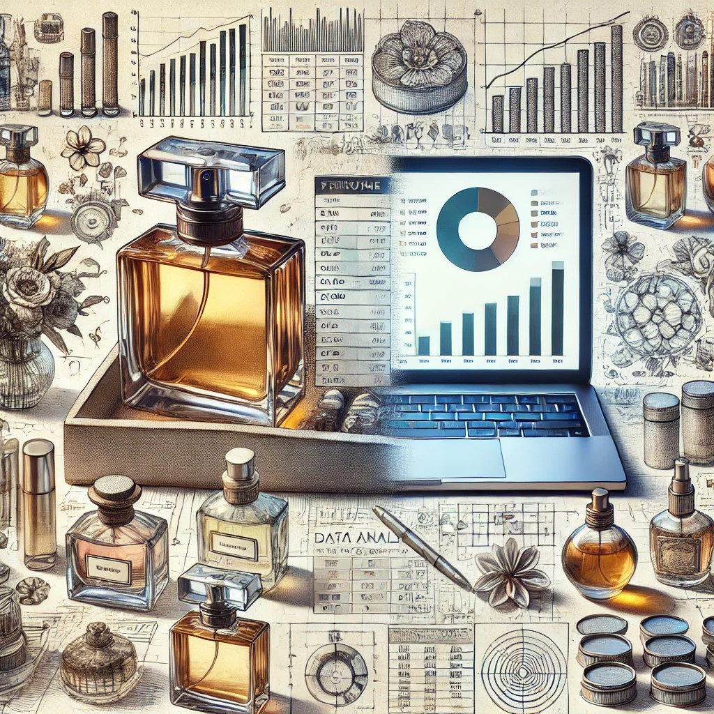

# Perfume_Market_Analysis

## Project Overview

This project centers around a comprehensive analysis of a perfume e-commerce dataset sourced from eBay, featuring 2000 perfume listings—1000 each for men and women. The analysis aims to explore market trends, customer preferences, and inventory management strategies through a systematic approach using Python, SQL, Power BI, and Tableau.

### Objective

The primary goal is to leverage data-driven insights to optimize inventory and pricing strategies, understand sales dynamics across different demographics, and ultimately enhance the decision-making process in the e-commerce sector.

### Dataset Overview

The Perfume E-Commerce Dataset 2024 comprises detailed information on perfume listings, including brand, title, type, price, availability, sold quantities, and geographical location. The dataset provides a comprehensive view of current market trends, pricing, and customer preferences.

### Data Science Applications

This dataset offers numerous opportunities for data science applications, including:

- Market Analysis: Understand market trends and consumer preferences by analyzing the pricing and availability of different perfume brands and types.
- Sales Prediction: Develop models to predict future sales based on historical data, aiding in inventory management and sales strategy optimization.
- Customer Insights: Gain insights into customer preferences and behaviors by examining the data on sold quantities and item locations.
- Price Optimization: Analyze price distributions and identify optimal pricing strategies to maximize revenue.
- Geographical Distribution: Study the geographical distribution of listings to understand regional market dynamics and demand variations.

### Data Processing and Analysis

#### Python Analysis

In Python, the following analysis was performed:

1. **Import and Preprocessing Data:**
   - Loaded data from CSV files.
   - Added a "gender" column and handled missing values.
   - Saved cleaned data to `sql_perfume_check.csv`.

2. **Product Category Analysis:**
   - Visualized sales volume and revenue by category.
   - Analyzed gender preferences and calculated average prices.

3. **Product Brand Analysis:**
   - Grouped data by brands to calculate averages.
   - Visualized sales distribution and identified brands contributing to 80% of revenue.

4. **Price Analysis:**
   - Grouped data to calculate price metrics and visualized price distribution.

5. **Geographic Analysis:**
   - Analyzed sales by region and evaluated stock utilization.

This analysis was executed in Python due to its powerful libraries for data manipulation and visualization, such as Pandas and Matplotlib, allowing for complex calculations and chart creation.

#### SQL Analysis

In SQL, the following actions were performed:

1. **Data Integration:**
   - Combined multiple tables to obtain comprehensive sales and pricing information.

2. **Data Aggregation:**
   - Executed queries to calculate average prices by category and assess stock levels.

3. **Query Optimization:**
   - Utilized indexing and other optimizations to enhance query performance.

SQL was used for structured data handling, enabling efficient aggregated queries and complex calculations necessary for in-depth analysis. This also ensures better performance when working with large datasets.

### Dashboard Development

In addition to the analyses conducted in Python and SQL, a dashboard was developed in Power BI for interactive visualization of the findings, providing stakeholders with a clear view of key metrics. An alternative visualization of the analysis was also created in Tableau, showcasing the versatility of the insights derived from the dataset.

,

### Conclusion

The analytical approach taken in this project showcases skills that are highly sought after across various industries. The ability to transform raw data into actionable insights is invaluable, especially in sectors like e-commerce and retail, where understanding customer preferences can drive sales strategies. Additionally, the creation of interactive dashboards and visualizations is crucial for effective decision-making, making these skills essential for roles in business intelligence and market research.

---

### Technologies

- Python
- SQL
- Power BI
- Tableau

### Folder File Description

| Folder | File | Description |
|-----------------|-----------------|-----------------|
| Functions |  | |
| Python | | Jupyter notebook - the process of cleaning, transforming, and analyzing the original data with visualizations |
| PPT | SLEBID_Scoring_Model_Development_June_2024.pptx | Project Presentation in PowerPoint Format [Presentation Slides](https://docs.google.com/presentation/d/178v7TiIdxXEeY77qPhUNx4hxJFgdtN40MWnh_xNDoOU/edit?usp=sharing). |

### Future Work

- Further feature engineering and selection to improve model performance.
- Exploration of different machine learning algorithms.
- Implementation of more advanced techniques for handling imbalanced data.

### Contact

If you have any questions or need further information, please feel free to contact me.  
E-mail: **Sergii.Lebid@yahoo.com**

---

